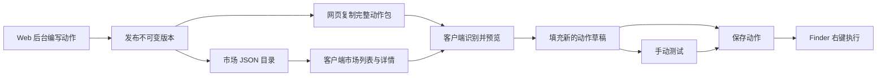

# RightKit 动作市场开发计划

状态：待后续项目实施。更新日期：2026-09-07。

目标是让作者在 Web 后台维护动作，用户复制完整配置或添加市场链接后，在 RightKit 中快速导入、测试并保存为 Finder 菜单项。

## 1. 当前基础与下一阶段范围

当前 macOS 客户端已经具备：

- 空白动作的创建、图标、分组、排序、适用对象和单选 / 多选规则。
- Python / zsh / bash / sh、内联代码与外部脚本、工作目录、环境变量、钥匙串密钥。
- 手动测试、输出日志、停止、超时，以及 Finder 到主应用的一次性执行请求。
- Python 自动选择：显式解释器 → `VIRTUAL_ENV` → `~/.venvs/rightkit` → 本机其他安装位置。

本次已移除新建菜单中的内置 demo。用户以前保存的动作仍是独立配置，不依赖 demo 注册表。

**本目录是未来能力的计划，当前客户端尚未实现剪贴板导入、市场 URL 或市场列表。**
Web 项目可以独立创建；完整交付还需要回到 `right-kit` 实现下文的客户端接入。

第一阶段交付以下闭环：

1. 管理员在 Web 创建、编辑并发布单个脚本动作。
2. 用户在网页点击「复制动作」，得到包含图标、规则、脚本和运行配置的 JSON。
3. 打开 RightKit 的「自定义动作」时识别该 JSON，点击导入后填充新草稿；也支持主动「粘贴导入」。
4. 用户输入市场链接，在自定义动作窗口内浏览、搜索、查看和导入市场动作。
5. 导入后沿用现有的编辑、测试、保存与 Finder 执行流程。

首期由市场管理员发布内容，公开浏览与复制无需登录。多人投稿可在这个闭环稳定后再增加。

## 2. 仓库与技术建议

建议新建独立 Web 仓库，例如 `rightkit-market`。推荐 TypeScript + Next.js、PostgreSQL、S3 兼容对象存储。
同一个 Web 项目提供管理后台、公开市场页面和 JSON 接口；技术栈可以调整，公开协议保持一致。

| 项目 | 负责内容 |
| --- | --- |
| 新 Web 项目 | 管理员登录、动作表单、发布与下架、公共详情页、复制动作、市场目录与版本文件 |
| 现有 RightKit | 动作包解析、剪贴板识别、URL 导入、市场列表、导入草稿、更新比较、本地依赖与密钥 |
| 共享协议 | 动作包、市场目录、字段限制、版本规则；两端共用 JSON 测试样本 |

新项目先复制整个 `plan/` 目录作为需求基线。现有脚本输入契约见
[自定义动作指南](../Docs/CustomActions.md)，源码位置见第 9 节。

## 3. 使用流程



### 3.1 网页复制 → 客户端填充

- 详情页「复制动作」复制完整、合法的 JSON，使用 `navigator.clipboard.writeText`，需要 HTTPS 和点击操作。
- 自定义动作窗口打开或成为前台时，仅在剪贴板 `changeCount` 变化后检查文本；限制大小后再解析。
- 格式匹配时显示简短入口「检测到动作：名称」，点击后创建已填充的新草稿。无匹配内容时不显示入口。
- 保留显式「粘贴导入」（建议 ⌘⇧V）；系统限制自动读取剪贴板时仍可使用。
- 接受纯 JSON，也可剥离一层完整的 Markdown `json` 代码围栏。格式不匹配时不把普通剪贴板文字当作脚本。
- 已有未保存草稿时，复用 `resolveUnsavedChanges()`；取消后保留原草稿。剪贴板变化本身不覆盖编辑内容。
- 同一份剪贴板只提示一次；复制操作不启动应用，不联网，不执行脚本。
- 导入后执行仍由用户点击「运行当前草稿」或保存后在 Finder 中触发。

### 3.2 市场链接 → 客户端浏览

- 自定义动作窗口增加「我的动作 / 动作市场」两个入口；当前编辑器保留在「我的动作」中。
- 市场页可添加、改名、移除多个来源，输入 URL 后读取市场 JSON。移除来源只移除订阅与缓存。
- 列表显示图标、名称、简短摘要、运行环境和版本；支持名称搜索、标签与运行环境筛选。
- 点开详情查看完整配置、代码和依赖，再点击「导入」进入与剪贴板相同的草稿流程。
- 输入以 `.json` 结尾的完整目录 URL 时直接读取；输入网站地址时只尝试其源站的
  `/.well-known/rightkit-market.json`。该文件不存在时提示填写目录 URL。
- 首期不解析任意 HTML 页面；Web 可以为同一市场同时提供页面与标准 JSON。
- 刷新市场与脚本执行相互独立，Finder 扩展不请求市场网络接口。

### 3.3 网页直接打开客户端

实现前两条流程后，可增加以下 URL 路由：

```text
rightkit://import?url=<经过百分号编码的 HTTPS 动作包 URL>
rightkit://market?url=<经过百分号编码的 HTTPS 市场目录 URL>
```

这些新路由只打开导入预览或市场来源确认界面。现有 `rightkit://custom?ticket=...` 继续只服务本地 Finder 执行；
不能将导入 URL 解释成执行请求。链接中不携带脚本、密钥或本地文件路径。

## 4. 动作包协议 v1

推荐标识：`format = "rightkit.action"`、`schemaVersion = 1`。首期一个包包含一个动作。
完整、可解析的协议样本在 [examples/action.json](examples/action.json)。它是协议资料，客户端不加载为内置动作。

先在 Web 建立 Zod 等运行时校验模型并导出 JSON Schema；客户端建立独立的 `ActionPackage` Codable DTO，
共用这些样本做往返测试。**不要直接把当前 `CustomAction` 的 Swift Codable 输出作为公开协议。**
当前图标枚举的编码、UUID、钥匙串引用和本机路径都是本地实现细节。

### 4.1 包元信息

| 字段 | 约定 |
| --- | --- |
| `format` / `schemaVersion` | 固定格式标识 / 整数协议版本；不支持的版本应明确报错 |
| `id` | 稳定的公开 ID，例如 `example.file.sha256`；ASCII 字母、数字、点、下划线、连字符，最多 120 字符 |
| `version` | SemVer，例如 `1.0.0`；同一 ID 的已发布版本不可覆盖 |
| `summary` | 最多 240 字符的简述，供列表展示 |
| `description` | 最多 16 KB UTF-8 的 Markdown；预览不执行 HTML 或 JavaScript |
| `publisher` | `id`、`name`、可选 `url`；Web 发布时由后台账号确定，剪贴板声明不代表已验证身份 |
| `license` / `homepage` / `tags` | 可选许可证、HTTPS 详情页，以及最多 12 个标签（每个最多 32 字符） |
| `minRightKitVersion` | 首个支持该包的客户端版本；建议导入功能首发使用 `1.2.0`，实施时统一真实版本 |
| `minMacOSVersion` | 最低 macOS 版本，当前执行能力基线为 `13.0` |
| `action` | 下表中的执行与菜单配置 |
| `requirements` | 依赖描述，见 4.3 |

### 4.2 `action` 的完整配置与本地映射

| 公开字段 | 内容 | 映射到当前客户端 |
| --- | --- | --- |
| `title` | 动作名称，最多 80 字符 | `CustomAction.title` |
| `group` | 菜单分组，最多 60 字符，可为空 | `group` |
| `icon` | `{ "kind": "symbol", "name": "number" }` 或 `{ "kind": "png", "data": "<Base64>" }` | SF Symbol，或解码后用 `CustomActionStore.addIcon` 生成本地图标文件 |
| `rules.target` | `files` / `folders` / `both` | `ActionInputRules.target` |
| `rules.fileType` | `any` / `images` / `extensions` | `fileType` |
| `rules.extensions` | 小写、不带 `.` 的扩展名数组；最多 64 个；指定扩展名时不可为空 | 规范化后合并到当前扩展名输入框 |
| `rules.selection` | `any` / `single` / `multiple` | `selection`；全部所选项仍须满足规则 |
| `language` | `python` / `zsh` / `bash` / `sh` | `ScriptLanguage` |
| `script.source` / `script.content` | v1 固定 `inline`；脚本文本最多 256 KB UTF-8 | `source = .inline`、`script`；代码、换行和引号原样保留 |
| `batchMode` | `together` / `individually` | `batchMode` |
| `workingDirectory.mode` | `selection` / `finder` / `custom` | `workingDirectory` |
| `workingDirectory.prompt` | `custom` 时可选，提示用户在本机选择目录 | 导入表单说明；实际目录由接收者绑定 |
| `timeoutSeconds` | 1–3600 的整数 | `timeoutSeconds` |
| `environment` | 最多 64 项，结构见下文 | 新生成变量 UUID，写入本地环境变量列表 |

普通环境变量：`{ "name": "QUALITY", "isSecret": false, "value": "85", "hint": "JPEG 质量" }`。
密钥变量：`{ "name": "UPLOAD_URL", "isSecret": true, "hint": "填写自己的预签名上传地址" }`，**不包含 `value`**。
`hint` 可选，最多 240 字符；变量名最多 128 字符，遵循现有名称规则，不重复、不使用 `RIGHTKIT_` 前缀；
普通值最多 16 KB UTF-8，不含空字符。密钥值由接收者在本机填写并存入钥匙串。

以下内容不进入公开包：本地动作 / 变量 UUID、启停状态、排序、本机解释器路径、外部脚本路径、
固定工作目录路径、测试文件、日志、钥匙串内容。它们属于安装此动作的本机配置。

导出当前动作时，外部脚本需在用户主动导出时读取为文本快照；读取失败就报错。
自定义图片需转换为 PNG 数据，不能只复制本地的 UUID 文件名。PNG 解码后最多 256 KB，规范为不超过 64×64 像素。
`custom` 工作目录在导入后需要重新选择；解释器默认留空，复用当前 Python 自动发现规则。

整个动作包上限为 8 MB UTF-8 JSON，同时检查各字段的字节上限。编辑后再调用现有 `CustomAction.validate()`，
保存仍受本地 100 个动作与整个目录 32 MB 的限制。未知执行字段、非法路径或损坏图标不得静默丢弃后执行。

### 4.3 Python 与命令依赖

```json
{
  "python": ">=3.10",
  "pythonPackages": [{ "name": "Pillow", "version": ">=12,<13" }],
  "commands": ["curl"]
}
```

`python` 可省略；两个数组可为空。包名和版本约束独立存储，不能把任意安装命令当成依赖定义。
首期在导入详情中显示依赖，并提供用户主动触发的环境检查 / 安装命令复制入口。
检查与手动测试使用同一个已选解释器；缺少 `PIL` 时明确显示缺少的是 `Pillow` 及对应解释器路径。

已创建的 `~/.venvs/rightkit` 可被多个动作复用。浏览市场、读取剪贴板、导入配置时均不自动安装依赖。
后续若增加安装按钮，也在用户点击后安装到选定环境，使用参数数组调用包管理器，复用任务日志与停止机制。

## 5. 市场目录协议 v1

完整样本见 [examples/market.json](examples/market.json)。其中的域名均为文档占位地址。

| 字段 | 内容 |
| --- | --- |
| `format` / `schemaVersion` | `rightkit.market` / `1` |
| `id` / `name` / `homepage` | 市场稳定 ID、显示名、HTTPS 首页 |
| `generatedAt` | RFC 3339 时间 |
| `items` | 当前页条目，最多 200 个；每个公开动作 ID 在目录中出现一次，指向最新发布版本 |
| `next` | 可选的下一页绝对 HTTPS URL；没有下一页时为 `null` |

每个条目包含 `id`、`version`、`title`、`summary`、`language`、`target`、`tags`、`symbol`、
`packageURL`、`sha256`、`updatedAt`。自定义图标可增加 `iconURL` 和 `iconSHA256`，加载失败时用 `symbol`。
版本、名称、运行环境等字段由后台从动作包提取，不能分别编辑出不一致的数据。

目录只提供摘要，完整脚本从 `packageURL` 获取。URL 均为绝对地址，首期目录翻页、包和图标要求与目录同源；
需要 CDN 时由服务端同源路由转发，后续再引入明确的资源源站列表。

- 市场前台、管理后台和 RightKit 默认每页 20 条，可选 50 / 100 条；先在服务端搜索、筛选和稳定排序，再返回当前页。更改筛选时回到第一页。
- 查询使用 `page`、`pageSize`、`q`、`language`、`tag`、`sort`，后台额外支持 `status`。返回 `pagination: { page, pageSize, total, totalPages }`；`next` 保留查询条件。更新检查可按 `ids` 查询已安装动作。
- 每页最多 2 MB，支持分页和 `ETag` / `If-None-Match`，客户端按需加载，不一次抓取全站；缓存与条件请求绑定到完整查询 URL。
- `sha256` 是发布时最终动作包 UTF-8 文件的 SHA-256，按下载解压后的原始文件字节计算，不重新序列化 JSON。
- 同一 `{id, version}` 的文件不可变，缓存可使用 `immutable`；发布新版本后更新目录及其 ETag。
- 校验下载的 ID、版本和 SHA-256 均与目录一致，再进入导入预览。
- SHA-256 检查内容一致性，不把它当作发布者身份或脚本可信度证明。
- 对重定向后的地址也检查 HTTPS 和同源规则；拒绝 `file:`、带用户密码的 URL、目录翻页环路。
- 直接添加包 URL 时没有目录中的哈希，标记为链接导入；不能冒充已从订阅市场验证的版本。

## 6. Web 后台与公开接口

### 页面

| 页面 | 必须完成的行为 |
| --- | --- |
| 动作列表 / 编辑页 | 空白创建，编辑完整 `action` 配置、图标、说明、依赖，保存草稿 |
| 发布页 | 校验字段、预览包、填写版本、发布；同一版本不能覆盖 |
| 公开市场列表 | 搜索、标签和运行环境筛选，展示最新发布动作 |
| 动作详情 | 展示配置与脚本，复制完整动作包、下载 JSON、打开客户端 |
| 版本记录 | 展示历史版本和说明；下架停止在目录推荐，保留版本的管理记录 |

管理员登录可采用 GitHub OAuth + 管理员 ID 白名单；公开读接口无需登录。
后台在服务端检查发布权限；不接受前端伪造发布者 ID。脚本作为数据存储，Web 服务不执行上传的脚本。

### API

| 方法与路径 | 语义 |
| --- | --- |
| `GET /.well-known/rightkit-market.json` | 市场目录发现入口，可同源重定向到标准目录 |
| `GET /rightkit/market.json?cursor=...` | 市场目录；分页链接写入 `next` |
| `GET /rightkit/actions/{id}/{version}.json` | 不可变版本文件 |
| `POST /api/admin/actions` | 创建后台草稿 |
| `PATCH /api/admin/actions/{id}` | 保存草稿；携带 revision 防止覆盖他人的更新 |
| `POST /api/admin/assets` | 上传图标、限制尺寸与大小、生成 PNG |
| `POST /api/admin/actions/{id}/versions` | 原子发布新版本，返回包 URL 与 SHA-256 |
| `POST /api/admin/actions/{id}/unpublish` | 下架目录条目；不影响用户已保存的本地动作 |

API 校验错误返回 `{ "code": "INVALID_PACKAGE", "message": "...", "fields": [{ "path": "action.title", "message": "..." }] }`。
公开 JSON 为 `application/json; charset=utf-8`；公开 GET 可提供 CORS，管理接口使用登录态与 CSRF 防护。

### 数据与发布事务

建议数据表：`publishers`、`actions`（含草稿与 revision）、`action_versions`、`assets`。
`action_versions` 对 `(action_id, version)` 建唯一约束，记录最终 JSON、摘要、对象存储位置、发布人和时间。

发布顺序：校验完整配置 → 规范化图标 → 生成唯一确定的版本文件 → 计算哈希 → 上传不可变对象 →
数据库事务提交版本及当前版本指针 → 刷新目录缓存。失败时保留旧目录，避免目录指向尚未可用的文件。
复制按钮返回该版本的完整 JSON 文本，不拼接另一个不完整的前端对象。

## 7. 客户端导入、身份与更新

两种导入入口都调用同一 `ActionPackageImporter`，只生成草稿，不直接改写 `actions.json`。

1. 限制输入大小，解码并校验协议 / 兼容版本。
2. 映射本地 `CustomAction`，生成全新的动作与变量 UUID，复制图标，保留脚本原文。
3. 展示来源、完整配置、依赖和本机待填项；密钥为空，固定目录需绑定，解释器默认自动选择。
4. 复用当前未保存更改处理，填入新草稿。允许用户编辑与手动测试，完成后保存。
5. 保存继续使用原子目录写入和现有钥匙串事务；未保存的图标由现有清理逻辑回收。

新增可选元信息 `origin` / `packageMetadata`，保存包 ID、版本、来源、导入时内容摘要、说明、依赖及环境变量提示。
旧配置缺少这些字段时按 `nil` 读取，不改变已有动作 ID、启停、排序或用户脚本。

订阅市场的安装身份以 `(规范化市场 URL, package.id)` 为准。剪贴板与直接链接导入记录独立来源类型，
其中声称的市场信息不能直接视为已验证来源。

重复导入相同版本时先定位已有动作，提供「打开已有 / 新建副本」。新版本到来时展示「可更新」，
用户打开后比较代码、规则、依赖和变量差异；保存更新前仍经过草稿流程。

本地已编辑的内容不在后台替换。更新要保留本地启停、排序、解释器、目录绑定，以及名称和类型未变的密钥引用；
变量改名或从普通值变为密钥时重新填写。被删除的密钥只在新目录成功保存后回收。
移除市场来源、市场离线或动作下架，不删除已安装的本地动作。

## 8. 缓存、失败与运行边界

- 主应用保存市场来源与缓存，建议位于 `Application Support/RightKit/Markets/`；无需 Finder 共享这些数据。
- 来源使用本地 UUID 作目录名，记录 URL、ETag、成功刷新时间；请求超时建议 15 秒、并发上限 3。
- 缓存命中后先展示列表再刷新。离线时显示最后一次成功数据及状态；首次加载失败提供重试。
- 下载失败、未知版本、哈希不一致、图标损坏、动作数量达到上限，都保留原有动作和草稿。
- 配置导入、目录浏览和后台更新检查只处理数据；不会调用脚本执行或钥匙串读取。
- 手动运行和 Finder 运行继续使用 `ScriptRunner` 的 argv、进程组、日志脱敏、超时和取消机制。
- 不把网站提供的脚本或动作 ID 直接接入执行 URL，不改变 App Group 和现有权限模型。

## 9. 现有客户端接入位置

| 位置 | 后续改动 |
| --- | --- |
| `Packages/RightKitShared/Sources/RightKitShared/` | 新增 `ActionPackage`、`MarketCatalog` DTO、字段校验和导入 / 导出映射 |
| `CustomAction.swift` / `CustomActionStore.swift` | 可选来源元信息、图标复用、旧目录兼容；保留本地目录格式与原子保存 |
| `Apps/RightKit/Services/CustomActionsModel.swift` | 导入草稿入口、未保存更改处理、重复导入、更新合并 |
| `Apps/RightKit/Services/` | 新增 `MarketService`、`MarketStore`、前台剪贴板识别服务 |
| `Apps/RightKit/Features/CustomActions/` | 粘贴导入、来源管理、市场列表、详情 / 差异预览 |
| `Apps/RightKit/AppDelegate.swift` | 单独处理 `import` / `market` URL，保留现有执行 ticket 路由 |
| `Packages/RightKitShared/Tests/RightKitSharedTests/` | 包兼容、字段映射、图标、来源身份、损坏输入与旧目录回归 |

界面延续当前的精简风格：不恢复 demo 下拉，不加入常驻说明段落；依赖、来源与错误在相应详情或操作发生时展示。

## 10. 实施顺序与验收

| 阶段 | 产物 | 完成条件 |
| --- | --- | --- |
| P0 协议 | JSON Schema、两端类型、共享样本；确定首个支持导入的客户端版本 | Python / Shell、图片图标、密钥声明、custom 目录样本通过两端校验 |
| P1 Web 后台 | 草稿、图标上传、发布、详情、完整复制 / 下载 | 从空白表单发布动作，得到不可变版本 URL 和正确 SHA-256 |
| P2 客户端复制导入 | 前台识别、主动粘贴、预览、填充、测试 / 保存 | 从网页复制后打开应用可导入，现有草稿和已保存动作均不丢失 |
| P3 市场列表 | 目录接口、来源管理、缓存、搜索筛选、链接导入 | 添加一个标准市场 URL 即可展示与导入；断网可查看缓存 |
| P4 更新与交付 | 差异预览、冲突处理、版本记录、部署与客户端使用文档 | 有本地修改及密钥时更新正确，已有 Finder 行为通过回归 |

优先完成 P0→P1→P2 的复制闭环，再接入市场列表。这样新 Web 项目与客户端可以分别开发并独立验收。

最终必须覆盖：

- 名称、图标、分组、适用条件、脚本、运行配置及普通变量导入后逐项一致。
- Unicode、空格、引号、美元符号和多行脚本原样往返；变量值不会被拼成命令。
- 换一台 Mac 导入时不携带另一台机器的路径、动作 UUID、测试文件或钥匙串值。
- 已有未保存草稿、重复包、来源同名、100 个动作上限都有明确行为。
- Python 自动环境复用正确；依赖缺失与解释器路径在检查 / 运行失败时可定位。
- 空剪贴板、普通文本、超大数据、错误 schema、错误哈希和失效分页链接都不会改动已有配置。
- 网络刷新和导入期间打开 Finder 菜单仍可正常使用；任何导入路径都不自动运行脚本。
- Web 发布 / 下架与目录缓存一致；历史版本字节及哈希不会变化。
- 客户端共享包测试、Debug / Release 构建和 `/Applications` 安装后的 Finder 检查通过。

## 11. 新项目启动说明

可将下面这段要求连同本目录交给下一次开发：

> 按 `plan/README.md` 创建独立的 RightKit 动作市场 Web 项目，先完成 P0 与 P1。
> 以 `rightkit.action` / `rightkit.market` v1 为公共协议，用共享 JSON 样本完成校验。
> 提供管理员动作编辑、发布、公开详情页、复制完整动作包和标准市场目录。
> 复制结果必须包含完整配置及可移植图标。公开接口不执行脚本，不包含用户密钥或本机路径。
> 在接口文档中明确列出仍需在现有 Swift 客户端完成的 P2–P4 接入工作。

部署时配置实际域名、管理员 OAuth、数据库与对象存储；将样本中的 `example.com` 地址替换为真实发布 URL。
不要把 `examples/` 中的协议资料自动种入客户端的新建动作菜单。
